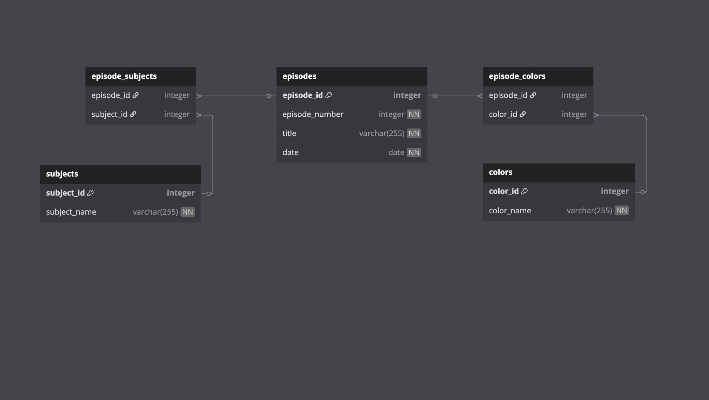

# The Joy Of Painting API

## Project Overview

This project provides an API to filter and retrieve episode information on "The Joy of Painting" by Bob Ross.

## Challenges Encountered

During the development of this API, several challenges emerged:

- **Handling Multiple Data Formats**: The original datasets had inconsistencies in naming conventions, which required implementing functions to standardize the data for consistent queries.
- **Efficient Query Handling**: The complexity of querying across large datasets with multiple filters posed performance challenges. Optimizing SQL queries and implementing indexing in PostgreSQL helped improve speed and accuracy.
- **Case Sensitivity**: Handling case insensitive queries, especially for color names and subject matter. I implemented custom functions to normalize the inputs and ensure users could query without worrying about capitalization.

## Features
### Implemented

- Filter by month

  - Allows users to filter episodes based on the month they were originally broadcasted

- Filter by subject matter

  - Allows users to filter episodes based on the subject matters in the paintings

- Filter by color palette

  - Allows users to filter episodes based on the colors used in the paintings

- Support for case insensitive queries
  - Users can query without worrying about case sensitivity in subject matter or color fields

## Installation

1.  Clone the repository
2.  Install dependencies
    `npm install`
3.  Set up the PostgreSQL database by running the sql script `psql -U your_user -d postgres -f create_db.sql`

4.  Start the server with
    `node server.js`

        The api will be running on http://localhost:3000

        You can test the api using Postman by sending GET requests to `http://localhost:3000/api/episodes`

## Authors

Braden Chance [GitHub](https://github.com/BPChance) | [LinkedIn](https://www.linkedin.com/in/bpchance/) | [Portfolio](https://bpchance.github.io/)

## About Me

Hi, I'm **Braden Chance**, a software engineer with a passion for building full-stack applications. I'm constantly learning new technologies to improve my skills. You can connect with me on [LinkedIn](https://www.linkedin.com/in/bpchance/)
, or check out my [Portfolio](https://bpchance.github.io/).
